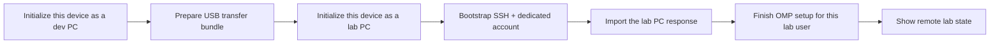

# AGENTS.md — Win-CoLab-Assistant

You are being pointed at this repository because a user wants to pair a development PC with a spare/lab Windows PC for administrative automation and native UI testing. This file is your entry point regardless of which agent you are (OMP, Claude Code, Codex CLI, or another AGENTS.md-aware agent).

## What this repository is

A single portable agent skill, `remote-windows-lab/`, plus documentation. It is not a service, not a library to import, and not something to "build." There is nothing to compile. Your job when asked to "use" or "implement" this repository is to:

1. Make the skill available to yourself or another agent (see **Install**, below).
2. Follow its conversational workflow to actually pair two machines (see **Operate**, below).

Do not restructure, rewrite, or "modernize" the skill unless the user explicitly asks you to change its behavior. If you find a genuine bug while operating it, fix it, run the verification in `remote-windows-lab/scripts/` yourself (see `docs/usage.md`), and explain the change — do not silently alter security-relevant defaults (firewall scope, account privileges, password-authentication timing, private-key handling).

## Install

Read [`docs/installation.md`](docs/installation.md) for exact per-agent steps. Summary:

- **OMP**: add this repository's path (or a symlink to `remote-windows-lab/`) to `skills.customDirectories` in `~/.omp/agent/config.yml`, then restart the session.
- **Claude Code**: copy or symlink `remote-windows-lab/` into `.claude/skills/remote-windows-lab/` (project-scoped) or `~/.claude/skills/remote-windows-lab/` (user-scoped).
- **Codex CLI / other agents without a native skill loader**: read `remote-windows-lab/SKILL.md` directly as your operating instructions for this task, or have the user copy its content into the target project's own agent-instructions file.

If you are already running as a subagent or session that was simply told "use `Win-CoLab-Assistant`" without a specific install step having been done yet, treat that as an implicit request to install it for the current agent runtime, then proceed to operate it.

## Operate

Once available, `remote-windows-lab/SKILL.md` is authoritative for behavior: conversational command mapping, dev PC/lab PC orchestration order, invariants, validation checklist, and troubleshooting. Read it in full before acting — do not skim.

Core loop, at a glance:

Non-negotiable behaviors (also stated in the skill itself — this is not a duplicate source of truth, just a reminder that they exist):

- Never expose SSH, browser CDP, VNC, or WinRM to the public Internet.
- The private SSH key never leaves the dev PC. Refuse any transfer bundle that looks like it contains one.
- Use a dedicated local lab account, not the user's daily or domain-administrator account.
- Do not disable SSH password authentication until key-only login has been verified from a second session.
- Stop and ask the user at physical/UAC/browser-extension boundaries. Do not fabricate their completion.
- Persist state after every step so work can resume if the session is interrupted.

## Using this skill inside another project

If a user says something like "point an agent at `Win-CoLab-Assistant` and have it set up dev/lab machines for `<project>`," do this:

1. Clone or otherwise make this repository available on the dev machine.
2. Install the skill for whichever agent will run there (see **Install**).
3. Start (or continue) a session for that agent in the target project's repository, so file paths like `<project-repo-url>` in the workflow resolve correctly.
4. Say (or have the user say) `Initialize this device as a dev PC for <project-repo-url>` and follow the skill's orchestration from there.

The skill is intentionally project-agnostic — it does not assume anything about what the paired lab machine will ultimately run. Any project needing a securely administered Windows test target can reuse it unmodified.

## Where to look for more detail

- [`docs/usage.md`](docs/usage.md) — full conversational walkthrough, exact commands, manual (non-agent) CLI reference, first-test example.
- [`docs/installation.md`](docs/installation.md) — per-agent installation and verification.
- [`docs/security.md`](docs/security.md) — threat model, invariants, what is and is not stored.
- [`remote-windows-lab/SKILL.md`](remote-windows-lab/SKILL.md) — the skill definition itself; authoritative for behavior.
- [`remote-windows-lab/references/device-state.schema.json`](remote-windows-lab/references/device-state.schema.json) — the device registry's JSON Schema.
