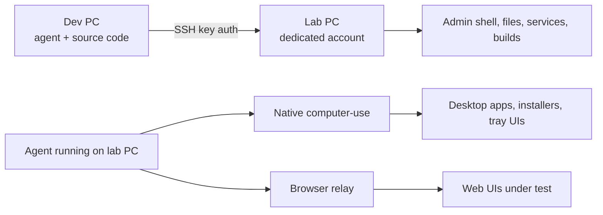

# Win-CoLab-Assistant

Windows Collaborative Lab Assistant — a portable agent skill that pairs a **development PC** with a **spare/lab Windows PC** for administrative automation and native UI testing, using an AI coding agent (OMP, Claude Code, or Codex) to guide the whole process conversationally.

It answers one recurring problem: *"I have a spare Windows laptop. How do I give my coding agent safe, reversible, full administrative and UI control of it for development and testing, without exposing anything to the Internet?"*



## What it does

- Walks you through pairing two Windows machines: one you develop on, one you test on.
- Generates a dedicated SSH key and a disposable local administrator account — never your daily account.
- Uses a USB thumb drive as the trust-establishing transfer channel. The private key never leaves the dev PC; the lab PC refuses any bundle that looks like it contains one.
- Installs and scopes Windows OpenSSH Server, with a firewall rule restricted to the dev PC's address (or VPN subnet), not the open Internet.
- Configures native computer-use (screen capture, input, UI Automation) and a browser relay directly on the lab PC, so desktop apps, installers, and tray UIs are testable — not just web pages.
- Tracks every device's state (`discovered → transfer_prepared → bootstrap_applied → ssh_verified → omp_pending → ready`) in a small local JSON registry, so you can pair any number of lab machines and always know what's configured where.
- Tells you exactly when a physical action (insert USB, sign in locally, click a UAC prompt, install a browser extension) is required, and waits for you — it never tries to fake past a boundary it cannot cross.

## Quick start

1. **Install the skill.** See [`docs/installation.md`](docs/installation.md) for OMP, Claude Code, and Codex-specific steps.
2. **On the dev PC**, tell your agent:
   > Initialize this device as a dev PC for `<project-repo-url>`.
3. **Connect a USB thumb drive** when asked. The agent prepares a transfer bundle (public key + scripts + this skill; no private key).
4. **Move the USB to the lab PC**, start your agent there, and say:
   > Initialize this device as a lab PC using the connected USB drive.
5. **Return the USB to the dev PC** and say:
   > Import the lab PC response.
6. **Sign in locally on the lab PC** as the new dedicated account and say:
   > Finish OMP setup for this lab user.
7. From then on, either machine can ask:
   > Show remote lab state.

Full walkthrough, exact commands, and troubleshooting: [`docs/usage.md`](docs/usage.md).

## Repository layout

```text
Win-CoLab-Assistant/
├── remote-windows-lab/        # The portable agent skill itself
│   ├── SKILL.md               # Skill definition (Agent Skills format)
│   ├── scripts/                # PowerShell implementation, callable directly
│   └── references/            # JSON schema for the device-state registry
├── docs/
│   ├── installation.md        # OMP / Claude Code / Codex setup
│   ├── usage.md                # Conversational workflow and manual CLI reference
│   └── security.md             # Threat model and invariants
└── AGENTS.md                   # Entry point for coding agents pointed at this repo
```

The skill works standalone: every script can be run directly from PowerShell without any AI agent involved (see [`docs/usage.md`](docs/usage.md#manual-cli-reference)). The agent layer exists to make the workflow conversational and to make good judgment calls about ambiguous physical state (which USB drive, which network interface, whether elevation is present) instead of failing outright.

## Requirements

- Two Windows 10 (build 19041+) or Windows 11 x64 machines, at least one with local administrator rights.
- PowerShell 5.1+ (PowerShell 7+ recommended) on both machines.
- A USB thumb drive for the initial trust handshake.
- An AI coding agent that supports the [Agent Skills](https://www.anthropic.com/engineering/equipping-agents-for-the-real-world-with-agent-skills) format (OMP, Claude Code) or that can be pointed at this repository's instructions directly (Codex CLI, or any agent that reads `AGENTS.md`).
- Optional: an organization VPN, WireGuard, or Tailscale if the two machines are not on the same trusted LAN.

## Design principles

- **Least privilege by default.** A dedicated local account, a dedicated SSH key, and a firewall rule scoped to one address/subnet — never the daily-use account, never `0.0.0.0/0`.
- **Nothing exposed to the Internet.** SSH, browser CDP, and the browser relay are for LAN/VPN use only. This skill never opens ports to the public Internet and refuses to help configure that.
- **Reversible.** Every setup step has a corresponding teardown step that removes only what this skill added.
- **Physical boundaries are respected, not routed around.** USB insertion, interactive sign-in, UAC consent, and browser-extension installation are called out explicitly and the agent waits for your confirmation.
- **No secrets in state.** The device registry stores hostnames, roles, addresses, and non-secret checks — never private keys, passwords, tokens, or session transcripts.

## License

[MIT](LICENSE).
